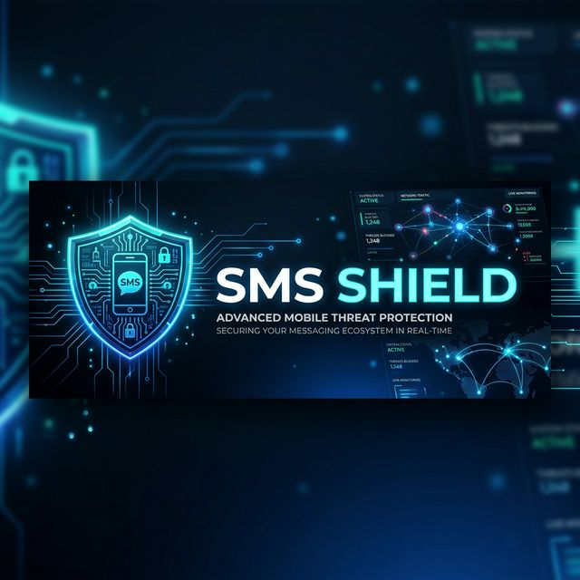

# 🛡️ SMS Shield (Phase 1 - MVP)



[](https://www.python.org/)
[](https://www.djangoproject.com/)
[](https://scikit-learn.org/)

**SMS Shield** is a high-performance, real-time SMS classification API. It uses a custom-trained **Multinomial Naive Bayes** model to accurately distinguish between "Ham" (legitimate) and "Spam" messages with ultra-low latency.

---

## 🚀 Key Features

- **⚡ Sub-100ms Response Time**: Optimized with a Singleton Model Loader that keeps the ML model persistent in memory.
- **🧠 Accurate Classification**: Trained on the UCI SMS Spam Collection dataset using reliable Scikit-Learn pipelines.
- **🛡️ Robust API**: Built with Django REST Framework, featuring strict input validation and clean error handling.
- **📂 Clean Architecture**: Decoupled training script (`train.py`) and inference logic for scalability.

---

## 🛠️ Tech Stack

- **Backend**: Django 6.0, Django REST Framework
- **ML Engine**: Scikit-Learn (Multinomial Naive Bayes)
- **Data Handling**: Pandas, Joblib
- **Database**: SQLite (Local MVP)

---

## 📦 Installation & Setup

1. **Clone & Setup Environment**
   ```powershell
   # Create Virtual Environment
   python -m venv venv
   .\venv\Scripts\activate
   
   # Install Dependencies
   pip install -r requirements.txt
   ```

2. **Train the Model**
   Before running the server, download the dataset and export the model binary.
   ```powershell
   python train.py
   ```
   *This will create the `models/` directory with `model.pkl` and `vectorizer.pkl`.*

3. **Start the Classifier**
   ```powershell
   python manage.py runserver
   ```

---

## 📡 API Documentation

### **Classify SMS**
`POST /api/v1/classify/`

**Request Body:**
```json
{
  "text": "Winner! You have won a 1000 dollar prize. Click here."
}
```

**Response Body:**
```json
{
  "text": "Winner! You have won a 1000 dollar prize. Click here.",
  "label": "Spam",
  "confidence": 0.9854,
  "status": "success"
}
```

---

## 🏗️ Architecture: The Singleton Loader

To ensure maximum performance, the ML model is **only loaded once** when the Django application initializes in `classifier/apps.py`. 

```python
# classifier/apps.py
class ClassifierConfig(AppConfig):
    def ready(self):
        # Model is loaded into memory on server start
        ClassifierConfig.model = joblib.load('models/model.pkl')
```

---

## 📜 License

Distributed under the MIT License. See `LICENSE` for more information.

---
*Built with ❤️ for secure messaging.*
